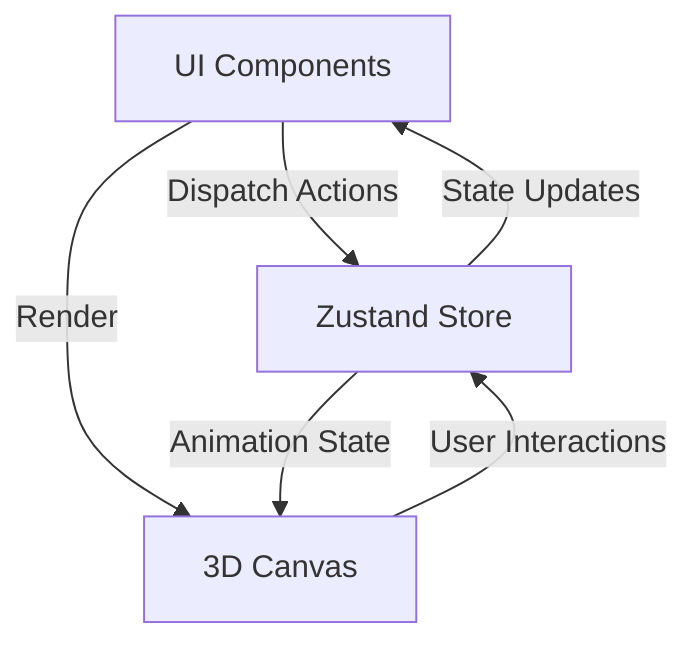

# BROski Architecture Deep Dive

## 1. System Integration Points

### 1.1 Component Interaction



### 1.2 Data Flow for Task Completion

1. User clicks "Complete Task" button
2. UI dispatches `completeTask` action with task ID
3. Zustand store updates task status and calculates rewards
4. 3D Avatar receives updated state and triggers celebration animation
5. UI reflects new coin balance and XP

## 2. Performance Optimizations

### 2.1 Build Optimizations (Vite)

```javascript
// vite.config.js
export default defineConfig({
  build: {
    rollupOptions: {
      output: {
        manualChunks: {
          react: ['react', 'react-dom', 'react-router-dom'],
          three: ['three', '@react-three/fiber', '@react-three/drei']
        }
      }
    }
  }
});
```

### 2.2 3D Performance

- **Lazy Loading**: 3D assets are loaded on-demand
- **Level of Detail (LOD)**: Different quality models based on device capability
- **Frustum Culling**: Only render objects in view
- **Instanced Meshes**: For repeated objects like coins or collectibles

## 3. Testing Strategy

### 3.1 Test Pyramid

```text
        [E2E Tests] (Playwright)
            /
           /  
[Integration Tests]  
  (React Testing Library)
         |
         |
 [Unit Tests]  
  (Vitest + Jest)
```

### 3.2 Test Coverage

- **Unit Tests**: Utility functions, Zustand store actions
- **Integration Tests**: Component interactions
- **E2E Tests**: Critical user journeys
- **Visual Regression**: For 3D components

## 4. Deployment Architecture

### 4.1 Build Process

```bash
# Production Build
$ npm run build

# Outputs to:
# - /dist (Vite output)
# - /build (if using Create React App)
```

### 4.2 Environment Variables

```env
VITE_API_URL=https://api.broski.app
VITE_FIREBASE_CONFIG={"apiKey": "..."}
VITE_ENV=production
```

## 5. Error Handling

### 5.1 Global Error Boundary

```jsx
// src/components/ErrorBoundary.jsx
class ErrorBoundary extends React.Component {
  state = { hasError: false, error: null };
  
  static getDerivedStateFromError(error) {
    return { hasError: true, error };
  }
  
  componentDidCatch(error, errorInfo) {
    // Log to error tracking service
    logErrorToService(error, errorInfo);
  }
  
  render() {
    if (this.state.hasError) {
      return <ErrorFallback error={this.state.error} />;
    }
    return this.props.children;
  }
}
```

### 5.2 Monitoring Setup

- **Frontend**: Sentry for error tracking
- **Backend**: Log aggregation with ELK Stack
- **Performance**: Web Vitals monitoring

## 6. Security Considerations

### 6.1 Frontend Security

- Content Security Policy (CSP) headers
- XSS protection via React's built-in escaping
- CSRF protection for forms
- Secure HTTP headers (helmet.js)

### 6.2 Authentication

- JWT token storage in httpOnly cookies
- Token refresh mechanism
- Rate limiting on authentication endpoints

## 7. Performance Monitoring

### 7.1 Key Metrics

- **LCP (Largest Contentful Paint)**: < 2.5s
- **FID (First Input Delay)**: < 100ms
- **CLS (Cumulative Layout Shift)**: < 0.1
- **3D FPS**: Maintain > 30fps on mid-range devices

### 7.2 Monitoring Tools

- **Web Vitals** for Core Web Vitals
- **React DevTools** for component performance
- **Three.js Stats** for 3D performance

## 8. Future Improvements

### 8.1 Code Splitting

- Route-based code splitting
- 3D asset lazy loading
- Dynamic imports for heavy components

### 8.2 Offline Support

- Service Worker for PWA capabilities
- IndexedDB for offline data storage
- Background sync for task updates

## 9. Development Workflow

### 9.1 Git Strategy

- Feature branches with `feature/` prefix
- Conventional commits
- PR reviews required
- Semantic versioning

### 9.2 CI/CD Pipeline

```yaml
# .github/workflows/deploy.yml
name: Deploy
on: [push]

jobs:
  build-and-deploy:
    runs-on: ubuntu-latest
    steps:
      - uses: actions/checkout@v2
      - uses: actions/setup-node@v2
      - run: npm ci
      - run: npm run build
      - run: npm run test
      - run: npm run deploy
```
