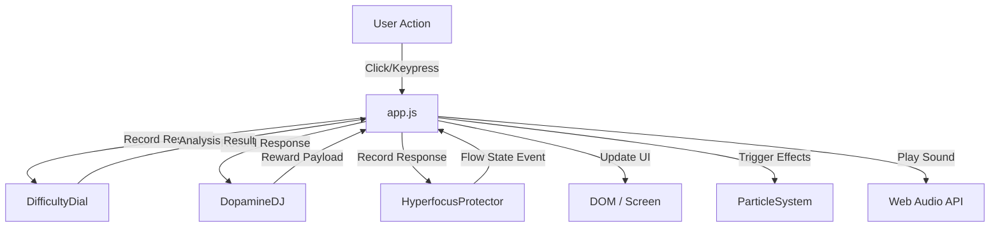

# 🏗️ Architecture & System Design

## Overview
The **Ultimate ADHD Brain Arcade** is a lightweight, zero-dependency web application designed to train cognitive skills through gamified engagement. It uses an **Agent-Based Architecture** where autonomous agents monitor player behavior and co-regulate the experience in real-time.

## 🧱 Core Components

### 1. The Game Hub (`index.html`)
The central entry point that handles:
*   **Energy Level Selection:** Users self-report energy (Low/Medium/High).
*   **Category Navigation:** Focus Primers, Attention Switchers, Flow Finders, Break Boosters.
*   **Stats Dashboard:** Displays Level, XP, Streak, and Coin Wallet.
*   **Agent Initialization:** Loads all agent scripts.

### 2. The Monolith Engine (`app.js`)
Currently acts as the central controller:
*   **Game State Management:** Tracks current session, scores, and timers.
*   **UI Rendering:** Dynamic DOM manipulation for game screens.
*   **Module Loading:** Dynamically loads game modules from `games/`.
*   **Agent Orchestration:** Feeds data to agents and executes their decisions.

### 3. The Agent Layer (`/agents`)
Autonomous modules that run in the background:
*   **DifficultyDial:** Monitors performance (accuracy/speed) to adjust difficulty.
*   **DopamineDJ:** Monitors momentum to trigger variable rewards.
*   **HyperfocusProtector:** Detects Flow State and manages UI distractions.

### 4. The Visual System (`/systems`)
*   **ParticleSystem:** Handles high-performance canvas effects (confetti, coins, ripples).

## 🔄 Data Flow



## 📂 Directory Structure

```
/
├── index.html          # Main entry point
├── style.css           # Global styles & animations
├── app.js              # Core game engine
├── agents/             # Intelligent Agents
│   ├── DifficultyDial.js
│   ├── DopamineDJ.js
│   └── HyperfocusProtector.js
├── games/              # Modular Game Logic
│   ├── StroopChallenge.js
│   └── DualNBack.js
├── systems/            # Visual/Audio Systems
│   └── ParticleSystem.js
├── tests/              # Unit Tests
└── docs/               # Documentation
```

## 🛠️ Technology Stack
*   **Frontend:** Vanilla JavaScript (ES6+), HTML5, CSS3.
*   **State Management:** In-memory objects (`playerState`, `currentSession`).
*   **Graphics:** HTML5 Canvas (Particle System).
*   **Audio:** Native Web Audio API (Oscillators).
*   **CI/CD:** GitHub Actions (Automated testing & deployment).

## 🚀 Future Roadmap
1.  **Modularization:** Split `app.js` into `GameEngine.js`, `UIManager.js`.
2.  **Persistence:** Save player progress to `localStorage` or a backend DB.
3.  **New Agents:** Implement `BodyDouble` (Coach).
